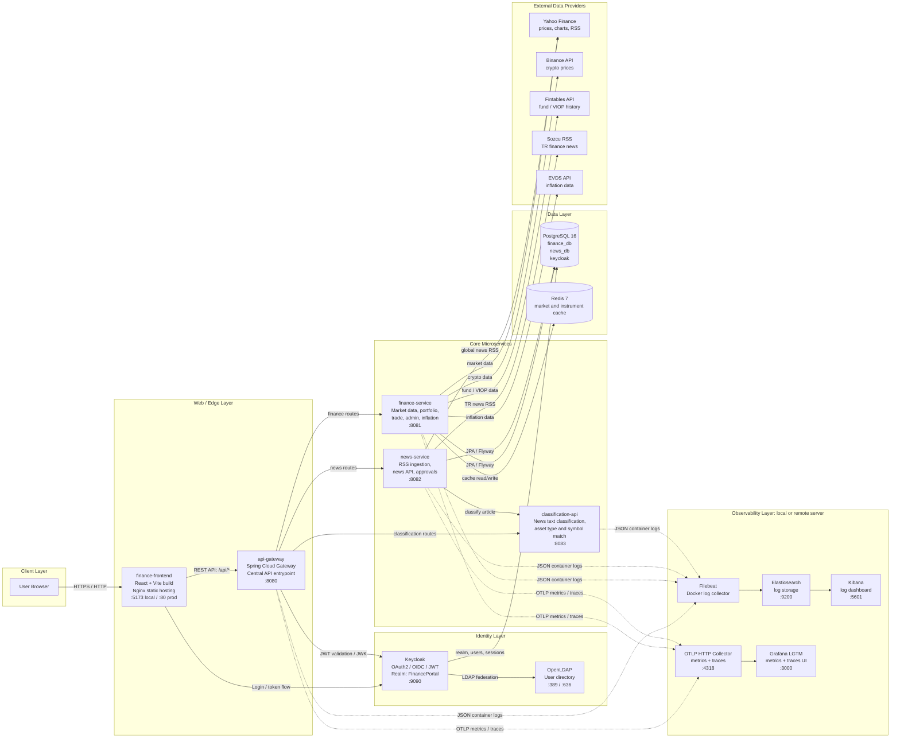

# Finance Portal [TR]

Finance Portal; piyasa verileri, finans haberleri, haber sınıflandırma, portföy yönetimi, login/rol yönetimi ve observability altyapısı olan mikroservis tabanlı bir finans uygulamasıdır.

Bu README'nin önceliği uygulamayı hızlıca çalıştırmaktır. Mimari ve genel bilgiler daha alt bölümlerdedir.

## 1. Uygulama Nasıl Çalıştırılır?

Bu proje default değerlerle Docker üzerinden çalışır. Ekstra `.env` dosyası oluşturmak zorunlu değildir.

Gerekenler:

- Docker Desktop veya Docker Engine
- Git

Adımlar:

```bash
git clone https://github.com/kayadogan1/Finance-Portal
cd Finance-Portal
docker compose up -d --build
```

Container durumunu kontrol et:

```bash
docker compose ps
```

Ana sayfayı aç:

[http://localhost:5173](http://localhost:5173)

Uygulama açıldıktan sonra ilk bakılacak ekran frontend ana sayfasıdır. Giriş yapmak için sağ üstteki `Giriş` veya `Kayıt Ol` akışı kullanılabilir.

Uygulamayı durdurmak için:

```bash
docker compose down
```

Geliştirme ortamında verileri de sıfırlamak gerekirse:

```bash
docker compose down -v
docker compose up -d --build
```

## 2. Çalışan Servisler ve URL'ler

| Amaç | URL |
| --- | --- |
| Web uygulaması | [http://localhost:5173](http://localhost:5173) |
| API Gateway | [http://localhost:8080](http://localhost:8080) |
| Gateway Swagger | [http://localhost:8080/swagger-ui.html](http://localhost:8080/swagger-ui.html) |
| Finance Swagger | [http://localhost:8081/swagger-ui.html](http://localhost:8081/swagger-ui.html) |
| News Swagger | [http://localhost:8082/swagger-ui.html](http://localhost:8082/swagger-ui.html) |
| Classification Swagger | [http://localhost:8083/swagger-ui.html](http://localhost:8083/swagger-ui.html) |
| Classification Health | [http://localhost:8083/api/v1/news/health](http://localhost:8083/api/v1/news/health) |
| Keycloak | [http://localhost:9090](http://localhost:9090) |
| phpLDAPadmin | [http://localhost:8085](http://localhost:8085) |

Keycloak lokal admin bilgisi:

```text
username: admin
password: admin
```

## 3. Container Üzerinden Kontrol

Bu proje değerlendirme/test sürecinde container üzerinden çalıştırılacak şekilde hazırlanmıştır. Servisleri host makinede tek tek ayağa kaldırmak zorunlu değildir.

Logları izlemek:

```bash
docker compose logs -f api-gateway finance-service news-service classification-api
```

Tek servis logu:

```bash
docker compose logs -f finance-service
```

Beklenen ana container'lar:

| Container | Açıklama |
| --- | --- |
| `finance-frontend` | React uygulamasını Nginx ile servis eder |
| `api-gateway` | Backend servislerinin tek giriş noktası |
| `finance-service` | Market, portföy, admin ve enflasyon işlemleri |
| `news-service` | Haber listeleme ve RSS yenileme |
| `classification-api` | Haber sınıflandırma servisi |
| `finance_db` | PostgreSQL |
| `finance-redis` | Redis cache |
| `finance_keycloak` | Kimlik yönetimi |
| `finance_openldap` | LDAP directory |
| `finance_filebeat` | Log collector |

## 4. Endpoint Özeti

Tüm detaylar Swagger UI üzerinden görülebilir. Ana giriş noktası API Gateway'dir:

```text
http://localhost:8080
```

Gateway route'ları:

| Path | Servis | Açıklama |
| --- | --- | --- |
| `/api/market/**` | finance-service | Enstrüman, market data, grafik ve fiyat verileri |
| `/api/portfolio/**` | finance-service | Portföy, para yatırma, al/sat, kar/zarar |
| `/api/admin/**` | finance-service | Admin metrikleri, provider status, instrument aktivasyonu |
| `/api/inflation/**` | finance-service | Enflasyon verileri |
| `/api/news/**` | news-service | Haber listesi, haber yenileme, provider status |
| `/api/v1/news/**` | classification-api | Haber sınıflandırma ve health |
| `/finance/v3/api-docs` | finance-service | OpenAPI JSON |
| `/news/v3/api-docs` | news-service | OpenAPI JSON |
| `/classification/v3/api-docs` | classification-api | OpenAPI JSON |

Önemli endpointler:

| Method | Endpoint | Açıklama |
| --- | --- | --- |
| `GET` | `/api/market` | Enstrümanları listeler |
| `GET` | `/api/market/{symbol}` | Tek enstrüman getirir |
| `GET` | `/api/market/candles/{symbol}` | Mum grafik verisi |
| `GET` | `/api/market/line/{symbol}` | Line chart verisi |
| `GET` | `/api/market/hypothetical-return/{symbol}` | Geçmiş alım senaryosu hesaplar |
| `GET` | `/api/portfolio/myPortfolios` | Kullanıcının portföylerini getirir |
| `POST` | `/api/portfolio/create` | Portföy oluşturur |
| `POST` | `/api/portfolio/deposit` | Portföye para yatırır |
| `POST` | `/api/portfolio/buy` | Enstrüman alır |
| `POST` | `/api/portfolio/sell` | Enstrüman satar |
| `GET` | `/api/portfolio/transactions` | İşlem geçmişi |
| `GET` | `/api/news` | Haberleri listeler |
| `POST` | `/api/news/refresh` | Haberleri manuel yeniler, admin ister |
| `GET` | `/api/news/topics` | Haber kategorileri |
| `GET` | `/api/admin/providers/status` | Finance provider durumları |
| `GET` | `/api/news/admin/providers/status` | News provider durumları |
| `GET` | `/api/v1/news/health` | Classification health |
| `POST` | `/api/v1/news/classify` | Haber başlığını sınıflandırır |

Detaylı endpoint dokümanı: [docs/API_ENDPOINTS.md](docs/API_ENDPOINTS.md)

## 5. Observability Bilgisi

Projede observability iki parçadır:

- Loglar: Spring servisleri JSON log üretir. Filebeat logları Elasticsearch'e taşır. Kibana üzerinden dashboard alınır.
- Metric/Trace: Spring Boot Actuator + OpenTelemetry verileri OTLP ile Grafana LGTM tarafına gönderilir.

Akış:

```text
Spring services -> Docker logs -> Filebeat -> Elasticsearch -> Kibana
Spring services -> OpenTelemetry OTLP -> Grafana LGTM
```

Önemli teslim notu:

- Uzak observability sunucusu güvenlik sebebiyle şu an kapalıdır ve IP bilgisi değişmiştir.
- Lokal makinede RAM kısıtı nedeniyle Elasticsearch ve Grafana testleri çalıştırılmamıştır.
- Elastic/Kibana ve Grafana doğrulamaları uzak sunucuda yapılmıştır.
- İlgili ekran görüntüleri `docs` klasöründe eklenmiştir.
- Proje sunumunda uzak sunucudaki docker imageları gösterilip sunulacaktır.

Uzak sunucu tekrar açıldığında opsiyonel olarak şu değişken kullanılabilir:

```bash
REMOTE_OBSERVABILITY_HOST=<remote-host-or-ip> docker compose up -d --build
```

Default çalıştırmada `.env` gerekmez. Observability endpointleri yoksa ana uygulama yine container üzerinden çalışır; sadece log/metric aktarımı uzak sisteme yapılamaz.

## 6. Ekran Görüntüleri ve Sayfa Eşleştirmesi

| Sayfa | Görsel |
| --- | --- |
| Landing / ana giriş ekranı |  |
| Landing / canlı ticker görünümü |  |
| Haberler sayfası |  |
| Login sayfası |  |
| Admin paneli |  |
| Kibana log dashboard üst görünüm |  |
| Kibana log dashboard detay görünüm |  |

## 7. Sistem Mimarisi


Mermaid Live:

[https://mermaid.live](https://mermaid.live)



## 8. Kullanılan Teknolojiler

| Alan | Teknoloji |
| --- | --- |
| Frontend | React 19, TypeScript, Vite, Tailwind CSS, Axios, React Query, Keycloak JS |
| Gateway | Spring Boot 4, Spring Cloud Gateway, Spring Security |
| Backend | Java 21, Spring Boot 4, Spring Data JPA, Flyway |
| Auth | Keycloak, OpenLDAP, OAuth2/OIDC, JWT |
| Database | PostgreSQL 16 |
| Cache | Redis 7 |
| News classification | Spring Boot, OpenNLP model dosyaları, lexicon/rule matching |
| API docs | Springdoc OpenAPI, Swagger UI |
| Observability | Filebeat, Elasticsearch, Kibana, OpenTelemetry, Grafana OTEL LGTM |
| DevOps | Docker, Docker Compose, GitHub Actions, GHCR, EC2 |

## 9. Deployment Özeti

Prod deployment akışı [`.github/workflows/deploy.yml`](.github/workflows/deploy.yml) içindedir.

Özet:

1. `main`, `master` veya `develop` branch'ine push yapılır.
2. GitHub Actions Maven build çalıştırır.
3. Değişen servislerin Docker imajları build edilir.
4. Imajlar GHCR'a push edilir.
5. EC2 sunucusuna bağlanılır.
6. Sunucuda `docker compose pull` ve `docker compose up -d --remove-orphans` çalışır.

Prod compose:

```bash
docker compose -f docker-compose.prod.yml pull
docker compose -f docker-compose.prod.yml up -d
```

---

# Finance Portal - [EN]

Finance Portal is a microservice-based finance application with market data, financial news, news classification, portfolio management, authentication/authorization, and observability support.

This section follows the same structure as the Turkish guide. The main goal is to run the application quickly with Docker, open the frontend, and inspect the services through Swagger.

## 1. How to Run the Application

The project runs with default Docker Compose values. Creating a separate `.env` file is not required.

Requirements:

- Docker Desktop or Docker Engine
- Docker Compose v2
- Git

Steps:

```bash
git clone <repo-url>
cd Finance-Portal
docker compose up -d --build
```

Check container status:

```bash
docker compose ps
```

Open the homepage:

[http://localhost:5173](http://localhost:5173)

After the application starts, the first screen to check is the frontend homepage. Use the `Giriş` or `Kayıt Ol` flow from the top-right area to sign in or register.

Stop the application:

```bash
docker compose down
```

Reset local development data:

```bash
docker compose down -v
docker compose up -d --build
```

## 2. Running Services and URLs

| Purpose | URL |
| --- | --- |
| Web application | [http://localhost:5173](http://localhost:5173) |
| API Gateway | [http://localhost:8080](http://localhost:8080) |
| Gateway Swagger | [http://localhost:8080/swagger-ui.html](http://localhost:8080/swagger-ui.html) |
| Finance Swagger | [http://localhost:8081/swagger-ui.html](http://localhost:8081/swagger-ui.html) |
| News Swagger | [http://localhost:8082/swagger-ui.html](http://localhost:8082/swagger-ui.html) |
| Classification Swagger | [http://localhost:8083/swagger-ui.html](http://localhost:8083/swagger-ui.html) |
| Classification Health | [http://localhost:8083/api/v1/news/health](http://localhost:8083/api/v1/news/health) |
| Keycloak | [http://localhost:9090](http://localhost:9090) |
| phpLDAPadmin | [http://localhost:8085](http://localhost:8085) |

Local Keycloak admin credentials:

```text
username: admin
password: admin
```

## 3. Container-Based Verification

This project is prepared to be evaluated and checked through containers. Running each service directly on the host machine is not required.

Follow logs:

```bash
docker compose logs -f api-gateway finance-service news-service classification-api
```

Follow a single service:

```bash
docker compose logs -f finance-service
```

Expected main containers:

| Container | Description |
| --- | --- |
| `finance-frontend` | Serves the React application through Nginx |
| `api-gateway` | Single entry point for backend services |
| `finance-service` | Market, portfolio, admin, and inflation operations |
| `news-service` | News listing and RSS refresh operations |
| `classification-api` | News classification service |
| `finance_db` | PostgreSQL |
| `finance-redis` | Redis cache |
| `finance_keycloak` | Identity management |
| `finance_openldap` | LDAP directory |
| `finance_filebeat` | Log collector |

## 4. Endpoint Summary

All details are available through Swagger UI. The main API entry point is the API Gateway:

```text
http://localhost:8080
```

Gateway routes:

| Path | Service | Description |
| --- | --- | --- |
| `/api/market/**` | finance-service | Instruments, market data, charts, and prices |
| `/api/portfolio/**` | finance-service | Portfolio, deposit, buy/sell, profit/loss |
| `/api/admin/**` | finance-service | Admin metrics, provider status, instrument activation |
| `/api/inflation/**` | finance-service | Inflation data |
| `/api/news/**` | news-service | News listing, news refresh, provider status |
| `/api/v1/news/**` | classification-api | News classification and health |
| `/finance/v3/api-docs` | finance-service | OpenAPI JSON |
| `/news/v3/api-docs` | news-service | OpenAPI JSON |
| `/classification/v3/api-docs` | classification-api | OpenAPI JSON |

Important endpoints:

| Method | Endpoint | Description |
| --- | --- | --- |
| `GET` | `/api/market` | Lists instruments |
| `GET` | `/api/market/{symbol}` | Gets a single instrument |
| `GET` | `/api/market/candles/{symbol}` | Candlestick chart data |
| `GET` | `/api/market/line/{symbol}` | Line chart data |
| `GET` | `/api/market/hypothetical-return/{symbol}` | Calculates a historical purchase scenario |
| `GET` | `/api/portfolio/myPortfolios` | Gets user portfolios |
| `POST` | `/api/portfolio/create` | Creates a portfolio |
| `POST` | `/api/portfolio/deposit` | Deposits cash into a portfolio |
| `POST` | `/api/portfolio/buy` | Buys an instrument |
| `POST` | `/api/portfolio/sell` | Sells an instrument |
| `GET` | `/api/portfolio/transactions` | Transaction history |
| `GET` | `/api/news` | Lists news |
| `POST` | `/api/news/refresh` | Manually refreshes news, requires admin |
| `GET` | `/api/news/topics` | News categories |
| `GET` | `/api/admin/providers/status` | Finance provider status |
| `GET` | `/api/news/admin/providers/status` | News provider status |
| `GET` | `/api/v1/news/health` | Classification health |
| `POST` | `/api/v1/news/classify` | Classifies a news headline |

Detailed endpoint document: [docs/API_ENDPOINTS.md](docs/API_ENDPOINTS.md)

## 5. Observability Notes

Observability has two main parts:

- Logs: Spring services produce JSON logs. Filebeat forwards logs to Elasticsearch. Kibana is used for dashboards.
- Metrics/Traces: Spring Boot Actuator and OpenTelemetry export data to Grafana LGTM through OTLP.

Flow:

```text
Spring services -> Docker logs -> Filebeat -> Elasticsearch -> Kibana
Spring services -> OpenTelemetry OTLP -> Grafana LGTM
```

Important delivery note:

- The remote observability server is currently shut down for security reasons, and its IP address has changed.
- Elasticsearch and Grafana could not be tested locally because of local RAM limitations.
- Elastic/Kibana and Grafana validation was performed on the remote server.
- Related screenshots are included under the `docs` directory.

When the remote server is available again, the optional host can be passed like this:

```bash
REMOTE_OBSERVABILITY_HOST=<remote-host-or-ip> docker compose up -d --build
```

The default run does not require `.env`. If observability endpoints are unavailable, the main application still runs through containers; only log/metric forwarding to the remote stack is unavailable.

## 6. Screenshots and Page Mapping

| Page | Screenshot |
| --- | --- |
| Landing / main entry screen |  |
| Landing / live ticker view |  |
| News page |  |
| Login page |  |
| Admin panel |  |
| Kibana log dashboard overview |  |
| Kibana log dashboard detail |  |

## 7. System Architecture

Mermaid Live-ready architecture file:

[docs/SYSTEM_ARCHITECTURE.mmd](docs/SYSTEM_ARCHITECTURE.mmd)

Mermaid Live:

[https://mermaid.live](https://mermaid.live)

The architecture is organized into these layers:

- Client Layer
- Web / Edge Layer
- Identity Layer
- Core Microservices
- Data Layer
- External Data Providers
- Observability Layer

## 8. Technologies Used

| Area | Technology |
| --- | --- |
| Frontend | React 19, TypeScript, Vite, Tailwind CSS, Axios, React Query, Keycloak JS |
| Gateway | Spring Boot 4, Spring Cloud Gateway, Spring Security |
| Backend | Java 21, Spring Boot 4, Spring Data JPA, Flyway |
| Auth | Keycloak, OpenLDAP, OAuth2/OIDC, JWT |
| Database | PostgreSQL 16 |
| Cache | Redis 7 |
| News classification | Spring Boot, OpenNLP model files, lexicon/rule matching |
| API docs | Springdoc OpenAPI, Swagger UI |
| Observability | Filebeat, Elasticsearch, Kibana, OpenTelemetry, Grafana OTEL LGTM |
| DevOps | Docker, Docker Compose, GitHub Actions, GHCR, EC2 |

## 9. Deployment Summary

The production deployment workflow is located at [`.github/workflows/deploy.yml`](.github/workflows/deploy.yml).

Summary:

1. A push is made to `main`, `master`, or `develop`.
2. GitHub Actions runs the Maven build.
3. Docker images are built for changed services.
4. Images are pushed to GHCR.
5. The workflow connects to the EC2 server.
6. The server runs `docker compose pull` and `docker compose up -d --remove-orphans`.

Production compose:

```bash
docker compose -f docker-compose.prod.yml pull
docker compose -f docker-compose.prod.yml up -d
```
